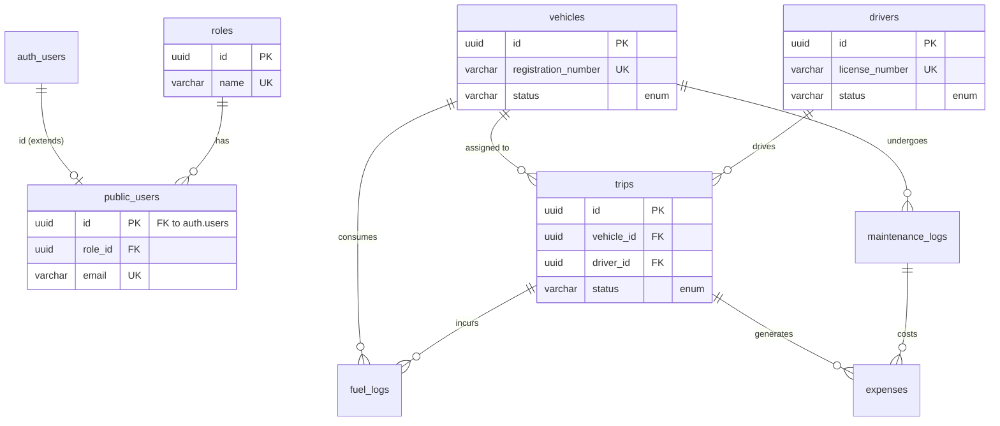

# TransitOps Database Documentation

This directory contains the database design, schema, seed files, and integration guides for the **TransitOps** project.

## Database Overview
The TransitOps database is built on PostgreSQL via Supabase. It uses a relational structure to manage users, fleet vehicles, drivers, trips, maintenance, and operational expenses in a tightly coupled manner to ensure data integrity.

## Files
- `schema.sql`: Contains the complete database schema with tables, extensions, relationships, constraints, indexes, and Row Level Security (RLS) policies.
- `seed.sql`: Contains a massive volume of realistic mock data for testing UI functionality (30+ vehicles, 20+ drivers, 50+ trips, etc.).
- `demo-users.md`: Contains demo login credentials for different roles.
- `integration-guide.md`: Contains schema details and recommended service configurations for frontend engineers.

## Entity-Relationship (ER) Diagram

## Table Architecture & Relationships

### 1. `roles` & `users`
- Connects Supabase's `auth.users` to our custom role-based access control (RBAC) system.
- Roles can be: `admin`, `dispatcher`, or `manager`.

### 2. `vehicles`
- Stores our fleet of vehicles. 
- Lifecycle statuses tracked via `status` ('active', 'in_maintenance', 'out_of_service').

### 3. `drivers`
- Stores driver details. 
- Driver statuses tracked via `status` ('available', 'on_trip', 'off_duty').

### 4. `trips`
- Central entity connecting a vehicle and driver.
- Enforces the rule that a trip references exactly one vehicle and one driver.
- Statuses: 'scheduled', 'in_progress', 'completed', 'cancelled'.

### 5. `maintenance_logs`
- References a vehicle to track service history.

### 6. `fuel_logs`
- References a vehicle and optionally a trip to track fuel consumption.

### 7. `expenses`
- Financial ledger. Can optionally reference a `trip_id` or `maintenance_id`.
- Types: 'fuel', 'maintenance', 'other'.

## Authentication Setup
Supabase Auth is configured for Email + Password sign-ins. Email confirmations have been intentionally disabled in `supabase/config.toml` (`enable_confirmations = false`) to ensure a smooth, click-and-go experience for hackathon judges using the demo accounts.

## Row Level Security (RLS) Policies
RLS is explicitly enabled on all tables in the `public` schema. For the hackathon demo, the policies are permissive but require authentication. All tables use `FOR ALL TO authenticated USING (true) WITH CHECK (true)` to allow full CRUD access strictly to logged-in users.

## Seed Instructions
To completely reset and populate the database with over 200 records of mock data:
1. Ensure the Supabase CLI is running (`npx supabase start`).
2. Run `npx supabase db reset` (which will run the migrations/schema and then the seed file), OR manually execute `seed.sql` in your Supabase SQL editor.
3. Use the credentials found in `demo-users.md` to log in.
