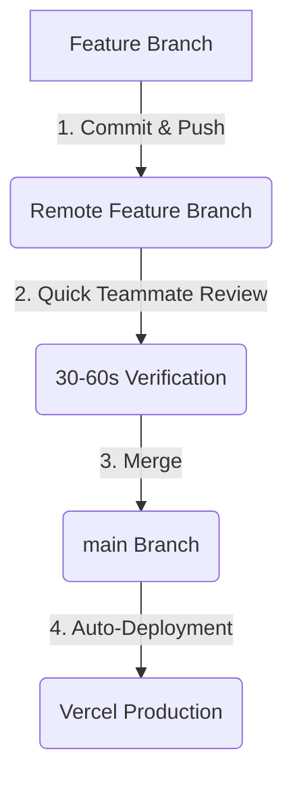

# TransitOps Developer & AI Guide

This document is the **single source of truth** for every developer and AI coding assistant working on the **TransitOps** repository.

---

## 🛠️ Project Stack

* **Frontend**: React + TypeScript
* **Styling**: Tailwind CSS
* **Database & Auth**: Supabase
* **Version Control**: GitHub

---

## 👥 Team Members & Responsibilities

### 🎨 Developer 1: Arjun
* **Role**: Frontend Developer & UI/UX Designer
* **Primary Responsibilities**:
  * Developing and styling reusable React components.
  * Building view pages, dashboards, and managing client-side routing.
  * Integrating frontend components with Supabase services provided by Janak.
* **Owned Folders**:
  * `frontend/src/pages`
  * `frontend/src/components`
  * `frontend/src/layouts`
  * `frontend/src/features`
  * `frontend/src/assets`
* **⚠️ Restrictions**: Must **NOT** modify the `database/` folder, `supabase` schema config, or other teammates' feature folders unless coordinated.

---

### ⚙️ Developer 2: Janak
* **Role**: Application Logic Engineer
* **Primary Responsibilities**:
  * Writing custom application query logic and interfacing with Supabase.
  * Managing authentication workflows and access validation.
  * Setting up business rules, helper utilities, and validation functions.
* **Owned Folders**:
  * `frontend/src/services` (Application logic and Supabase client integration)
  * `frontend/src/hooks` (Custom hooks for UI data binding)
  * `frontend/src/utils` (Helper validation functions and utilities)
* **⚠️ Restrictions**: Must **NOT** modify UI presentation styles or layouts unless explicitly requested by Arjun.

---

### 💾 Developer 3: Rajkumar
* **Role**: Database & Infrastructure Engineer
* **Primary Responsibilities**:
  * Designing tables, relationships, and index optimizations.
  * Configuring Supabase schema and Row Level Security (RLS) policies.
  * Preparing seed data and database migrations.
* **Owned Folders**:
  * `database`
  * `supabase`
* **⚠️ Restrictions**: Must **NOT** modify any frontend React components or layouts.

---

## 📂 Folder Ownership Matrix

The following matrix defines editing permissions across the repository:

| Folder Path | Primary Owner | Allowed Editors | Read Permission |
| :--- | :--- | :--- | :--- |
| `frontend/src/pages` | **Arjun** | Arjun | All |
| `frontend/src/components`| **Arjun** | Arjun | All |
| `frontend/src/layouts` | **Arjun** | Arjun | All |
| `frontend/src/features` | **Arjun** | Arjun | All |
| `frontend/src/assets` | **Arjun** | Arjun | All |
| `frontend/src/services` | **Janak** | Janak | All (For integration) |
| `frontend/src/hooks` | **Janak** | Janak | All |
| `frontend/src/utils` | **Janak** | Janak | All |
| `database` | **Rajkumar** | Rajkumar | All |
| `supabase` | **Rajkumar** | Rajkumar | All |

---

## 🌿 Branch Strategy

We follow a simplified branch strategy tailored for a fast-paced 8-hour hackathon. Direct commits to `main` are prohibited.

```text
main (Production & Auto-Deploy)
├── feature/frontend (Arjun's workspace)
├── feature/app-logic (Janak's workspace)
└── feature/database (Rajkumar's workspace)
```

* **`main`**: The primary branch. Any changes merged here trigger an automatic deployment to Vercel. Pull from `main` before starting any task.
* **`feature/frontend`**: Arjun's workspace for React page views, components, layouts, and Tailwind styling.
* **`feature/app-logic`**: Janak's workspace for services, custom hooks, utilities, and Supabase integration.
* **`feature/database`**: Rajkumar's workspace for database schemas, seeds, RLS policies, and configurations.

---

## 🔄 Development Workflows

### 📥 1. Before Starting Work
Before writing any code, execute these steps in order:
1. `git checkout main`
2. `git pull`
3. `git checkout <your-feature-branch>` (or create it if starting a new task, e.g. `feature/frontend`)
4. `npm install` (only if new dependencies were pulled in)
5. `npm run dev` (run the local server)
6. Ensure the project builds and runs cleanly.

### 📝 2. Git Merge Workflow
The process to integrate feature changes safely:


----

## 💬 Commit Message Convention

We enforce the Conventional Commits style and encourage small, frequent commits:

* `feat(vehicles): build fleet table`
* `feat(drivers): add registry page`
* `feat(auth): integrate Supabase login`
* `fix(trips): correct dispatch validation`
* `docs(database): update schema`

### 💻 Laptop Sharing Guidelines
Since Arjun and Janak may share a single development laptop:
- It is fully acceptable to switch branches locally.
- Make commits individually using your respective author metadata.
- When both developers actively collaborate on a set of changes, use Git's `Co-authored-by: Name <email>` trailers at the bottom of the commit message description.

---

## 🤖 AI Workflow

Before writing any code, every AI coding assistant must:

1. Read `TEAM_GUIDE.md`
2. Read `EXECUTION_PLAN.md`
3. Read `AGENTS.md`
4. Determine the current developer's role and ownership.
5. Identify the files owned by that developer.
6. Explain the implementation plan before coding.
7. List every file that will be modified.
8. If any file belongs to another developer, STOP and explain why instead of modifying it.
9. Only then begin implementation.

Never immediately generate code.
Never make assumptions about ownership.

---

## 🤖 Rules for AI Assistants

AI assistants working on this project must adhere strictly to these operational rules:

1. **Strict File Scope**: Modify **only** the files you have been explicitly requested to change.
2. **Preserve Locations**: Never move files or folders to new locations.
3. **No Dynamic Installs**: Never install new npm packages or devDependencies.
4. **No Folder Renaming**: Never change naming schemas or folder architectures.
5. **Component Reusability**: Search the `frontend/src/components` directory and reuse existing UI patterns before creating new ones.
6. **Tailwind Framework**: Rely entirely on Tailwind CSS utility styling.
7. **Clean Path Aliases**: Use `@/` imports for elements under the `src/` directory.
8. **Consultation**: Ask for confirmation before editing shared service utilities or core router patterns.

## File Ownership Rule

If a file belongs to another developer:

- Do NOT modify it.
- Do NOT format it.
- Do NOT move it.
- Do NOT rename it.
- If changes are required, explain why and stop.

Even if the AI thinks it can improve the code, it must not edit another developer's files without permission.

---

## ✅ Definition of Done

A task is considered complete only if:

- The project builds successfully.
- There are no TypeScript errors.
- Existing functionality still works.
- The UI is responsive.
- Tailwind follows project conventions.
- Imports use the `@/` alias where applicable.
- No unused imports remain.
- No dead code remains.
- No unnecessary packages were installed.
- Changes are limited to the developer's owned files.
- Integration points are documented if another teammate must continue the work.

---

## Before Every Commit

Run through this checklist before staging and committing files:
- [ ] **Builds Successfully**: Run `npm run build` locally to verify there are no bundler bugs.
- [ ] **No TypeScript Errors**: Run typechecks to ensure type safety is maintained.
- [ ] **No Unused Imports**: Remove dead code, unused imports, or variables.
- [ ] **Clean Logs**: Remove debugging `console.log` statements unless they are intentional.
- [ ] **No Credentials**: Double check that API keys, passwords, or secrets are not committed.
- [ ] **Pull Target Branch**: Run `git pull origin main` to resolve merge conflicts locally.